# OptimalBlue Bank App - Architecture Diagrams

## 1. System Architecture Overview

```mermaid
graph TB
    subgraph "Client Layer - Port 5173"
        A[React App]
        A1[Vite Dev Server]
        A --> A1
    end
    
    subgraph "Server Layer - Port 3001"
        B[Express API]
        B1[CORS Middleware]
        B2[Body Parser]
        B --> B1
        B --> B2
    end
    
    subgraph "Data Layer"
        C[(SQLite Database)]
        C1[mortgage.db]
        C --> C1
    end
    
    A1 -->|HTTP Requests| B
    B -->|SQL Queries| C
    
    style A fill:#61dafb
    style B fill:#68a063
    style C fill:#003b57
```

## 2. Client-Side Component Architecture

```mermaid
graph TB
    subgraph "React Application"
        Main[main.jsx]
        App[App.jsx]
        Router[React Router]
        
        subgraph "Components"
            Nav[Navbar.jsx]
            Calc[MortgageCalculator.jsx]
        end
        
        subgraph "Routing"
            R1[/ - Home]
            R2[/rates - Rates View]
            R3[/calculators - Calculator View]
        end
        
        subgraph "Assets & Styles"
            CSS[index.css]
            TW[Tailwind CSS]
            Assets[assets/]
        end
    end
    
    Main --> App
    App --> Router
    App --> Nav
    Router --> Calc
    
    R1 -.->|view='all'| Calc
    R2 -.->|view='rates'| Calc
    R3 -.->|view='calculator'| Calc
    
    App --> CSS
    App --> TW
    App --> Assets
    
    style Main fill:#61dafb
    style App fill:#61dafb
    style Nav fill:#4fc3f7
    style Calc fill:#4fc3f7
```

## 3. Server-Side API Architecture

```mermaid
graph TB
    subgraph "Express Server - index.js"
        Server[Express App]
        
        subgraph "Middleware"
            MW1[CORS]
            MW2[Body Parser JSON]
        end
        
        subgraph "API Endpoints"
            EP1[GET /api/rates]
            EP2[POST /api/calculate]
        end
        
        subgraph "Business Logic"
            Logic1[Fetch Rates]
            Logic2[Calculate Payment Formula]
        end
    end
    
    subgraph "Database Module - database.js"
        DB[SQLite3 Connection]
        
        subgraph "Database Operations"
            Init[Initialize DB]
            Create[Create Tables]
            Seed[Seed Data]
        end
        
        subgraph "Schema"
            Table[rates table]
            Fields["id, product_name,<br/>interest_rate, apr,<br/>term_years"]
        end
    end
    
    Server --> MW1
    Server --> MW2
    Server --> EP1
    Server --> EP2
    
    EP1 --> Logic1
    EP2 --> Logic2
    
    Logic1 --> DB
    Logic2 -.->|read-only reference| DB
    
    DB --> Init
    Init --> Create
    Create --> Seed
    Create --> Table
    Table --> Fields
    
    style Server fill:#68a063
    style DB fill:#003b57
    style EP1 fill:#ffa726
    style EP2 fill:#ffa726
```

## 4. Data Flow - Mortgage Rate Retrieval

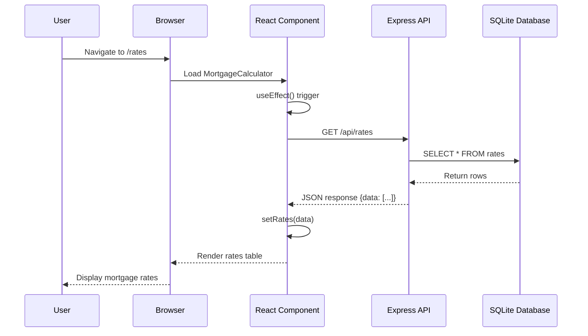

## 5. Data Flow - Mortgage Payment Calculation

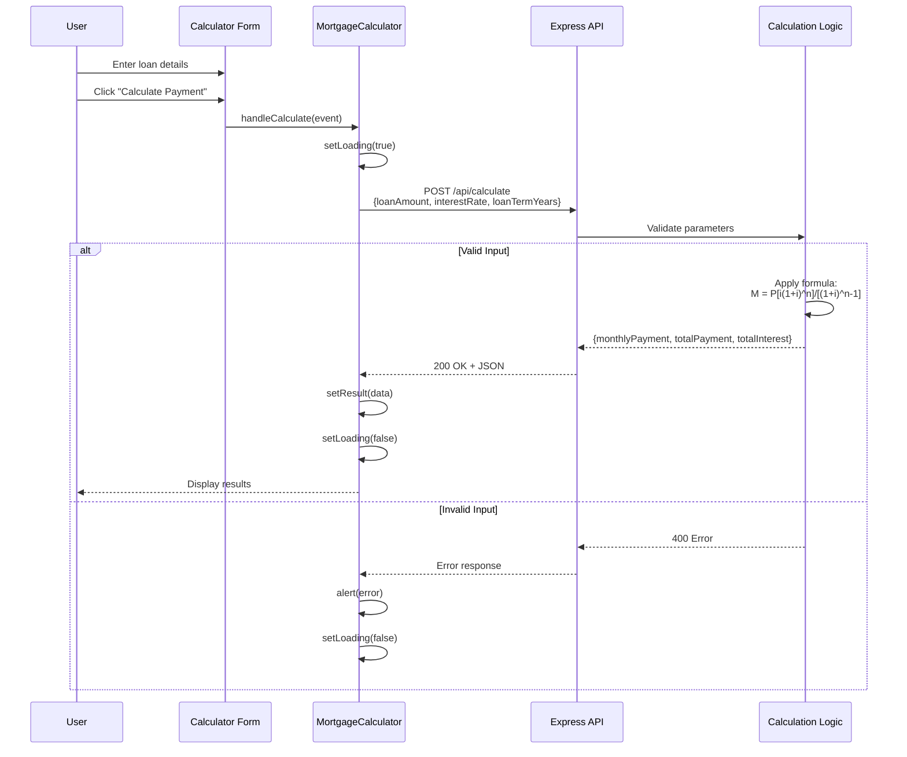

## 6. Component State Management

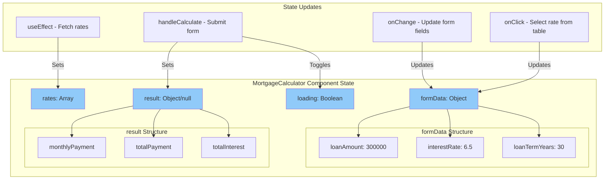

## 7. Database Schema & Initialization Flow

```mermaid
graph TB
    subgraph "Database Initialization"
        Start[database.js loaded]
        Connect[Create SQLite Connection]
        Serialize[db.serialize]
        
        subgraph "Table Creation"
            Create[CREATE TABLE IF NOT EXISTS rates]
            Schema["Schema:<br/>id INTEGER PRIMARY KEY<br/>product_name TEXT<br/>interest_rate REAL<br/>apr REAL<br/>term_years INTEGER"]
        end
        
        subgraph "Data Seeding"
            Check[Check if empty]
            Prepare[Prepare statement]
            Insert1[30-Year Fixed: 6.5%, 6.62%]
            Insert2[15-Year Fixed: 5.8%, 5.95%]
            Insert3[5/1 ARM: 6.1%, 6.8%]
            Insert4[FHA 30-Year: 6.0%, 6.9%]
            Finalize[Finalize statement]
        end
        
        Export[Export db module]
    end
    
    Start --> Connect
    Connect --> Serialize
    Serialize --> Create
    Create --> Schema
    Schema --> Check
    Check -->|Empty| Prepare
    Check -->|Has data| Export
    Prepare --> Insert1
    Insert1 --> Insert2
    Insert2 --> Insert3
    Insert3 --> Insert4
    Insert4 --> Finalize
    Finalize --> Export
    
    style Connect fill:#003b57
    style Schema fill:#80deea
    style Insert1 fill:#4db6ac
    style Insert2 fill:#4db6ac
    style Insert3 fill:#4db6ac
    style Insert4 fill:#4db6ac
```

## 8. Routing Architecture

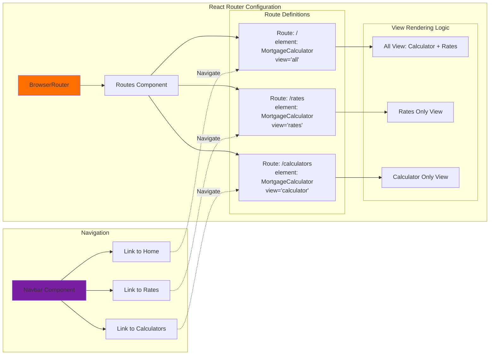

## 9. Build & Development Pipeline

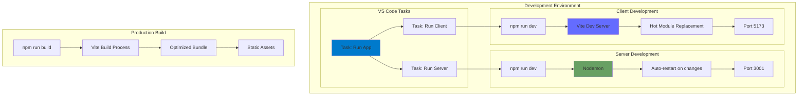

## 10. Technology Stack Overview

```mermaid
graph TB
    subgraph "Frontend Stack"
        FE1[React 19.2.0]
        FE2[React Router DOM 7.9.6]
        FE3[Vite 7.2.2]
        FE4[Tailwind CSS 4.1.17]
        FE5[ESLint]
    end
    
    subgraph "Backend Stack"
        BE1[Node.js]
        BE2[Express 5.1.0]
        BE3[SQLite3 5.1.7]
        BE4[CORS 2.8.5]
        BE5[Body Parser 2.2.0]
        BE6[Nodemon 3.1.11]
    end
    
    subgraph "Development Tools"
        DEV1[VS Code]
        DEV2[Tasks Configuration]
        DEV3[Git]
    end
    
    subgraph "Architecture Pattern"
        ARCH[3-Tier Architecture]
        L1[Presentation Layer]
        L2[Application Layer]
        L3[Data Layer]
    end
    
    FE1 --> L1
    FE2 --> L1
    FE3 --> L1
    FE4 --> L1
    
    BE1 --> L2
    BE2 --> L2
    BE4 --> L2
    BE5 --> L2
    
    BE3 --> L3
    
    ARCH --> L1
    ARCH --> L2
    ARCH --> L3
    
    style FE1 fill:#61dafb
    style BE2 fill:#68a063
    style BE3 fill:#003b57
    style ARCH fill:#ff9800
```

## 11. API Contract Specification

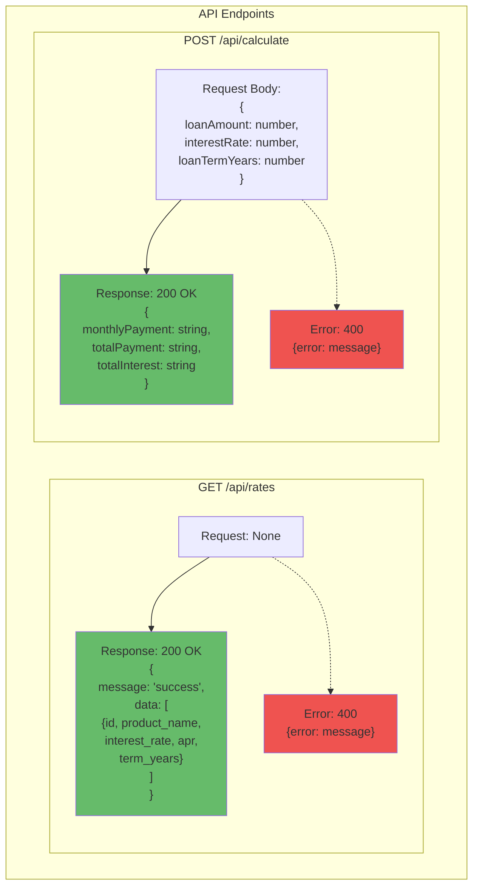

## 12. Deployment & Execution Flow

```mermaid
graph TB
    subgraph "Application Startup"
        Start[Start Application]
        
        subgraph "Server Initialization"
            S1[Load database.js]
            S2[Initialize SQLite]
            S3[Create tables]
            S4[Seed data if needed]
            S5[Load Express app]
            S6[Apply middleware]
            S7[Register routes]
            S8[Start listening on port 3001]
        end
        
        subgraph "Client Initialization"
            C1[Start Vite dev server]
            C2[Load index.html]
            C3[Execute main.jsx]
            C4[Render App.jsx]
            C5[Initialize Router]
            C6[Mount components]
            C7[Serve on port 5173]
        end
        
        Ready[Application Ready]
    end
    
    Start --> S1
    S1 --> S2
    S2 --> S3
    S3 --> S4
    S4 --> S5
    S5 --> S6
    S6 --> S7
    S7 --> S8
    
    Start --> C1
    C1 --> C2
    C2 --> C3
    C3 --> C4
    C4 --> C5
    C5 --> C6
    C6 --> C7
    
    S8 --> Ready
    C7 --> Ready
    
    style Start fill:#4caf50
    style Ready fill:#4caf50
    style S8 fill:#68a063
    style C7 fill:#646cff
```
